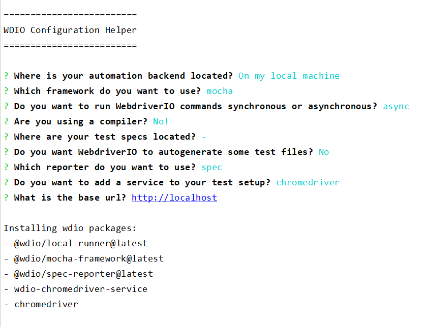

# qmate service (WebdriverIO)
Qmate-service Is an easy-to-use UI and E2E test automation [custom service](https://webdriver.io/docs/customservices/) based on [Webdriver.io](https://webdriver.io/).
It provides helpful reuse methods for any web application to write scripts more easily.


## Quicklinks
[Reuse API](./reuse/doc.md) |
[Samples](documentation/downloads/samples) |
[Business Object Reuse](https://github.wdf.sap.corp/sProcurement/vyperBusinessObjectReuse) |
[Spotlight - Chrome Extension](https://github.wdf.sap.corp/sProcurement/vyper-spotlight)


## Table Of Contents
- [Setup & Installation](./documentation/topics/setupAndInstallation.md)
- [Native Features](./documentation/topics/nativeFeatures.md)
- Custom Features
  - [Reuse](./reuse.md)
  - [Authentication](./authentication.md)
  - [Data Exchange](./dataImportExport.md)
  - [OData](./documentation/topics/odata.md) 
- Custom Services
    - [wdio-qmate-reporter-service](https://github.tools.sap/sProcurement/wdio-qmate-reporter-service)
    - [wdio-qmate-bo-reuse-service](https://github.tools.sap/sProcurement/wdio-qmate-bo-reuse-service)
    - [wdio-qmate-code-coverage-service](https://github.tools.sap/sProcurement/wdio-qmate-code-coverage-service)
- [UI5 Selectors](./documentation/topics/locators.md)
- [Non UI5 Elements](./documentation/topics/locators.md)
- [Contribution](./documentation/topics/contribution.md)

---

## About
### Native wdio- and qmate common reuse API
*wdio-qmate-service* allows you to use all the native webdriver.io commands and features and
provides additionally access to the qmate [Reuse API](./reuse/doc.md).

### Flexibility / Advanced Setup
Compared to [qmate](https://github.tools.sap/sProcurement/qmate) - which covers all related custom services like common reuse, reporting etc. out of the box, *wdio-qmate-service* provides you more flexibility to enable only the services and [features](#Native_Features) you require and is intended as more advanced setup. 


## Getting started

To use `wdio-qmate-service` in your project:

**Step 1:** Install WDIO and initialize project (if your repo is empty and you want to create tests from scratch):

(if you've already had tests and configuration file, just skip step 1. and go to step 2.)

```shell script
npm i @wdio/cli
npx wdio config
```

Examples of selections for `npx wdio config` command

1) chrome+mocha


2) chrome+jasmin


3) selenium+jasmin


**Step 2:** Configure nexus npm registry (local / global)

1) Local config (recommended):

   Create `.npmrc` file in the root directory of your project and fill it with following content
```shell
registry=http://nexus.wdf.sap.corp:8081/nexus/content/groups/build.milestones.npm/
strict-ssl=false
no-proxy=nexus.wdf.sap.corp
```

2) Global config:

   Invoke following commands in your terminal

```shell
npm config set strict-ssl=false
npm config set registry=http://nexus.wdf.sap.corp:8081/nexus/content/groups/build.milestones.npm/
npm config set no-proxy=nexus.wdf.sap.corp
```

**Step 3:** Add `wdio-qmate-service` as a devDependency:

1) Get latest version
```shell script
npm install @wdio/qmate-service@latest --save-dev
```

or 

2) Get specific version
```shell script
npm install @wdio/qmate-service@1.1.5 --save-dev
```

**Step 4:** For your first script you will need at least 2 files. Create one test spec file and one configuration file.

**1.** Test specification file 'test.spec.js'.

```bash
describe("My first test", function() {
  it("step1:click on the first standard item", async function() {
    await browser.url("#/categories");
    const selector = {
      "elementProperties":{
        "metadata":"sap.m.StandardListItem",
        "bindingContextPath" : "/ProductCategories('AC')"
      }};
    await ui5.common.userInteraction.click(selector);
  });

  it("step1:navigate back to main page", async function() {
    const selector = {
      "elementProperties":{
        "metadata":"sap.m.Button",
        "type":"Back"
      }
    };
    await ui5.common.assertion.expectToBeVisible(selector);
    await ui5.common.userInteraction.click(selector);
  });
});
```

**2.** Configuration file 'test.conf.js'.

with `require` statement (explicit import)
```js
const WdioQmateService = require("@wdio/qmate-service");
const path = require("path");
...
exports.config = {
  ...
    services: [
      [WdioQmateService],
      // all other services
    ],
    
    // test specs you would like to run (accepts wildcard paths ex. '/test/**/*.spec.js')
    specs: [path.resolve(__dirname, "test.spec.js")],
    
    // baseUrl you would like to use
    baseUrl: "https://sapui5.hana.ondemand.com/test-resources/sap/m/demokit/cart/webapp/index.html"
...
}
```

Note: do not use [implicit import](https://github.tools.sap/sProcurement/wdio-qmate-service/issues/5) for qmate-service:

```js
exports.config = {
...
    services: [
                ["qmate"], // does not work
                ...
    ]
...
}
```

Please, have a look at WDIO [test runner configuration](https://webdriver.io/docs/configurationfile/) for all parameters
or use provided configuration [templates](tests/helper/configurations)

**Step 5** Run tests:

```shell script
npx wdio <path/to/your/config.js>
```

---

## Contact
### Marvin Grüßinger
⌂ Walldorf - Germany\
✉ marvin.gruessinger@sap.com

### Benjamin Warth
⌂ Walldorf - Germany\
✉ benjamin.warth@sap.com

### Georgios Treska
⌂ Walldorf - Germany\
✉ georgios.treska@sap.com