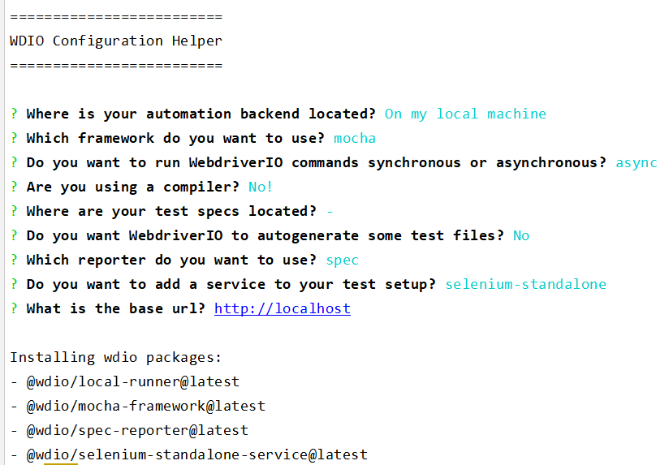

# Qmate WDIO service

Is an easy-to-use UI and E2E test automation [custom service](https://webdriver.io/docs/customservices/) based on [Webdriver.io](https://webdriver.io/).
It provides helpful reuse methods for any web application to write scripts more easily.


[Documentation is in process]


## Why wdio-qmate-service?

`wdio-qmate-service` allows you to use all the native webdriver.io commands and features, 
providing access to [Reuse API](./reuse/doc.md).

`wdio-qmate-service` provides you more flexibility than [qmate](https://github.tools.sap/sProcurement/qmate).


#### It allows you to choose WDIO features you prefer :
- [frameworks](https://webdriver.io/docs/frameworks/) (jasmin, mocha, cucumber), 
- compilers ([typescript](https://webdriver.io/docs/typescript/#compile--lint), [babel](https://webdriver.io/docs/babel/)), 
- reporters ([allure](https://webdriver.io/docs/allure-reporter), [html](https://webdriver.io/docs/rpii-wdio-html-reporter) etc.)
- [assertion libraries](https://webdriver.io/docs/assertion)
- services ([selenium](https://webdriver.io/docs/selenium-standalone-service), [chromedriver](https://webdriver.io/docs/wdio-chromedriver-service), [devtools](https://webdriver.io/docs/devtools-service) etc.)
- add logic to [WDIO hooks](https://webdriver.io/docs/options/#hooks)

## Quicklinks

[MIGRATION GUIDE](./documentation/topics/migration.md) |
[Reuse API](./reuse/doc.md) |
[Business Object Reuse](https://github.wdf.sap.corp/sProcurement/vyperBusinessObjectReuse) |
[Samples](documentation/downloads/samples) |
[Spotlight - Chrome Extension](https://github.wdf.sap.corp/sProcurement/vyper-spotlight)


## Table Of Contents
- [Actions & Reuse](./documentation/topics/actionsAndReuse.md)

- [Data](./documentation/topics/data.md)

- [Data Exchange](./documentation/topics/dataImportExport.md)

- [Qmate UI5 Locators](./documentation/topics/locators.md)

- [Authentication](./documentation/topics/authentication.md)

- [Contribution](./documentation/topics/contribution.md)

- [OData](./documentation/topics/OData.md)


## Getting started

To use `wdio-qmate-service` in your project:

**Step 1:** Install WDIO and initialize project (if your repo is empty and you want to create tests from scratch):

(if you've already had tests and configuration file, just skip step 1. and go to step 2.)

```shell script
npm i @wdio/cli
npx wdio config
```

Examples of selections for `npx wdio config` command

1) chrome+mocha


2) chrome+jasmin


3) selenium+jasmin



**Step 2:** Configure nexus npm registry (local / global)

1) Local config (recommended):

   Create `.npmrc` file in the root directory of your project and fill it with following content
```shell
registry=http://nexus.wdf.sap.corp:8081/nexus/content/groups/build.milestones.npm/
strict-ssl=false
no-proxy=nexus.wdf.sap.corp
```

2) Global config:

   Invoke following commands in your terminal

```shell
npm config set strict-ssl=false
npm config set registry=http://nexus.wdf.sap.corp:8081/nexus/content/groups/build.milestones.npm/
npm config set no-proxy=nexus.wdf.sap.corp
```

**Step 3:** Add `wdio-qmate-service` as a devDependency:

1) Get latest version
```shell script
npm install @wdio/qmate-service@latest --save-dev
```

or 

2) Get specific version
```shell script
npm install @wdio/qmate-service@1.1.5 --save-dev
```

**Step 4:** For your first script you will need at least 2 files. Create one test spec file and one configuration file.

**1.** Test specification file 'test.spec.js'.

```bash
describe("My first test", function() {
  it("step1:click on the first standard item", async function() {
    await browser.url("#/categories");
    const selector = {
      "elementProperties":{
        "metadata":"sap.m.StandardListItem",
        "bindingContextPath" : "/ProductCategories('AC')"
      }};
    await ui5.common.userInteraction.click(selector);
  });

  it("step1:navigate back to main page", async function() {
    const selector = {
      "elementProperties":{
        "metadata":"sap.m.Button",
        "type":"Back"
      }
    };
    await ui5.common.assertion.expectToBeVisible(selector);
    await ui5.common.userInteraction.click(selector);
  });
});
```

**2.** Configuration file 'test.conf.js'.

with `require` statement (explicit import)
```js
const WdioQmateService = require("@wdio/qmate-service");
const path = require("path");
...
exports.config = {
  ...
    services: [
      [WdioQmateService],
      // all other services
    ],
    
    // test specs you would like to run (accepts wildcard paths ex. '/test/**/*.spec.js')
    specs: [path.resolve(__dirname, "test.spec.js")],
    
    // baseUrl you would like to use
    baseUrl: "https://sapui5.hana.ondemand.com/test-resources/sap/m/demokit/cart/webapp/index.html"
...
}
```

Note: do not use [implicit import](https://github.tools.sap/sProcurement/wdio-qmate-service/issues/5) for qmate-service:

```js
exports.config = {
...
    services: [
                ["qmate"], // does not work
                ...
    ]
...
}
```

Please, have a look at WDIO [test tunnner configuration](https://webdriver.io/docs/configurationfile/) for all parameters
or use provided configuration [templates](tests/helper/configurations)

**Step 5** Run tests:

```shell script
npx wdio <path/to/your/config.js>
```

## Samples and tests

`qmate-service` can be integrated with wdio available frameworks/features:
- [Jasmine tests](documentation/downloads/samples/jasmineFramework)
- [Mocha tests](documentation/downloads/samples/mochaFramework)
- [Cucumber tests](documentation/downloads/samples/cucumberFramework)
- [Typescript tests](documentation/downloads/samples/typescriptSupport)
- [Sync tests](documentation/downloads/samples/syncSupport)
- [Selenium-standalone tests](documentation/downloads/samples/seleniumStandalone)


---
### Notes

1. If you face such error `command not found: wdio`, remove your package-lock.json, run `npm cache clean --force` and run `npm install`.
   We moved `@wdio/cli` from `dependencies` to `devDependencies`, so you  just to refresh your local dependencies and cache.
   
2. Please, use `npx wdio <config file>` instead of `wdio <config file>`.

If you see an error 
```
'wdio' is not recognized as an internal or external command,
operable program or batch file.
```

it means you try to use `wdio` as a command to execute tests suite.


3. It is not required to run `npm i` in root package, if you want to run tests ß there is no dependencies in wdio-qmate-service (only devDependencie)