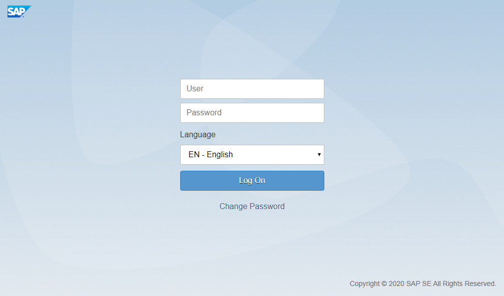
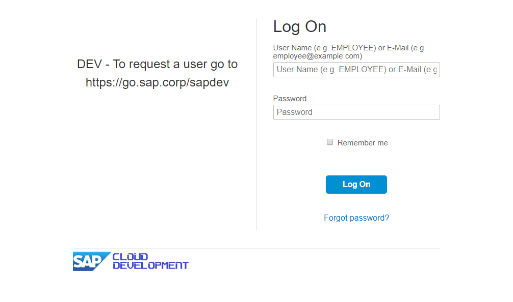

# Best Practices - Authentication
For the standard Fiori and Cloud login Pages, we provide some configuration parameters and reuse methods to enable you an easy way of system authentication.

There are two different approaches to log into the system:

- [Via reuse methods](#via-reuse-methods) (recommended)
- [Via configuration file](#via-configuration-file)

Which way to choose depends on your needs and preferences. If you are testing a scenario which goes through various systems (especially non UI5 systems) it is not recommended/possible to use a global authentication via the configuration file. If there is only one login during the script execution, it is up to you, to do the authentication via the configuration file. 
!!! info
        For consistency reasons we recommend to use the login via reuse methods only.


## Via reuse methods
The other way of system authentication, is to use the specific [reuse method](https://sap.github.io/wdio-qmate-service/doc/#ui5.session). 
This is commonly recommended, especially if you are switching between multiple users or systems during the test execution. 
With this approach, you handle the login within a step of your script/s. 
The benefit of this approach is, to have more control over the login as an actual step inside your test process. 
With that, you are able to use the login/logout multiple times during the test execution if you need to switch users or systems during runtime.

You can use one of the following methods:

=== "Generic Login"
    There is a generic login function which can be used for both types of forms (fiori & sap-cloud) to authenticate. This function will automatically determine the right login form and call the proper function.

    ```js
    it("Step 01: login generic", async function () {
        await ui5.session.login("JOHNDOE", "abc123");
    });
    ```

=== "Fiori Login"
    Use this configuration for the [Fiori Login Screen](#Fiori-Login-Screen).
    Define the step (on top of your script) and pass at least a valid user to the method. 

    ```js
    it("Step 01: login fiori", async function () {
        await ui5.session.loginFiori("JOHNDOE", "abc123");
    });
    ```

=== "SAP Cloud Login"
    Use this configuration for the [SAP Cloud Login Screen](#SAP-Cloud-Login-Screen).
    Define the step (on top of your script) and pass at least a valid user to the method. 

    ```js
    it("Step 01: login sap cloud", async function () {
        await ui5.session.loginSapCloud("JOHNDOE", "abc123");
    });
    ```

=== "Custom Login"
    If you want to define your own custom form, you can use the following method. 

    Define the step (on top of your script) and pass the ```username```, ```password```, ```usernameFieldSelector```, ```passwordFieldSelector``` 
    and ```logonButtonSelector```. Therefore, you need to define the CSS selectors of the corresponding elements.

    ```js
    it("Step 01: login Custom", async function () {
        const username = "JOHNDOE";
        const password = "Greetings1!";
        const usernameSelector = "#USERNAME_BLOCK input";
        const passwordSelector = "#PASSWORD_BLOCK input";
        const loginButtonSelector = "#LOGIN_LINK";
        await ui5.session.loginCustom(username, password, usernameSelector, passwordSelector, loginButtonSelector);
    });
    ```

!!! tip
        You can disable the login centrally without touching your specs by setting the `formType` to `"skip"` inside your configuration file.

## Via configuration file
Inside the *conf.js* file You can specify how the script will automatically log into the system. This will only be executed once before the first script gets executed. Hence, we recommend to use this only if you are not switching between multiple users or systems during the test execution.

There are multiple options, based on the login screen to set the ```formType``` of the [Configuration](<todo-add-configuration-md>).

=== "Fiori Login"
    Use this configuration for the [Fiori Login Screen](#Fiori-Login-Screen).
    You only need to specify the ```username``` and ```password```.
    ```js
    auth: {
        formType: "fiori-form",
        username: "JOHNDOE",
        password: "Greetings1!"
    },
    ```

=== "SAP Cloud Login"
    Use this configuration for the [SAP Cloud Login Screen](#SAP-Cloud-Login-Screen).
    You only need to specify the ```username``` and ```password```.
    ```js
    auth: {
        formType: "sapcloud-form",
        username: "JOHNDOE",
        password: "Greetings1!"
    },
    ```

=== "Others"
    The following options for ```formType``` are also available. You need to specify the ```username``` and ```password``` for this configuration.

    - ```XSA-form```
    - ```POT-form```
    - ```MIA-form```
    - ```UI5-Form```

=== "Custom Login"
    If you want to define your own custom form, you can use the following configuration.
    Additionally to the ```username``` and ```password```, you need to specify the ```usernameFieldSelector```, ```passwordFieldSelector``` and ```logonButtonSelector```. Therefore set the CSS selectors of the corresponding elements.

    ```js
    auth: {
        formType: "custom-form",
        username: "JOHNDOE",
        password: "Greetings1!",
        usernameFieldSelector: "#USERNAME_BLOCK input",
        passwordFieldSelector: "#PASSWORD_BLOCK input",
        logonButtonSelector: "#LOGIN_LINK"
    },
    ```

=== "Skip Login"
    Use this configuration to skip the login and logout inside the specs.
    ```js
    auth: {
        formType: "skip"
    },
    ```

## Logout
To logout from a S/4 system, please use the following method.
```js
it("Step XX: logout", async function () {
    await ui5.session.logout();
});
```

!!! info
        Please note, if `formType` is set to `"skip"`, the logout will be skipped as well.

## Finding the right login form
Please use the screenshots to find the proper login form.
=== "Fiori Login Screen"
    

=== "SAP Cloud Login Screen"
    


